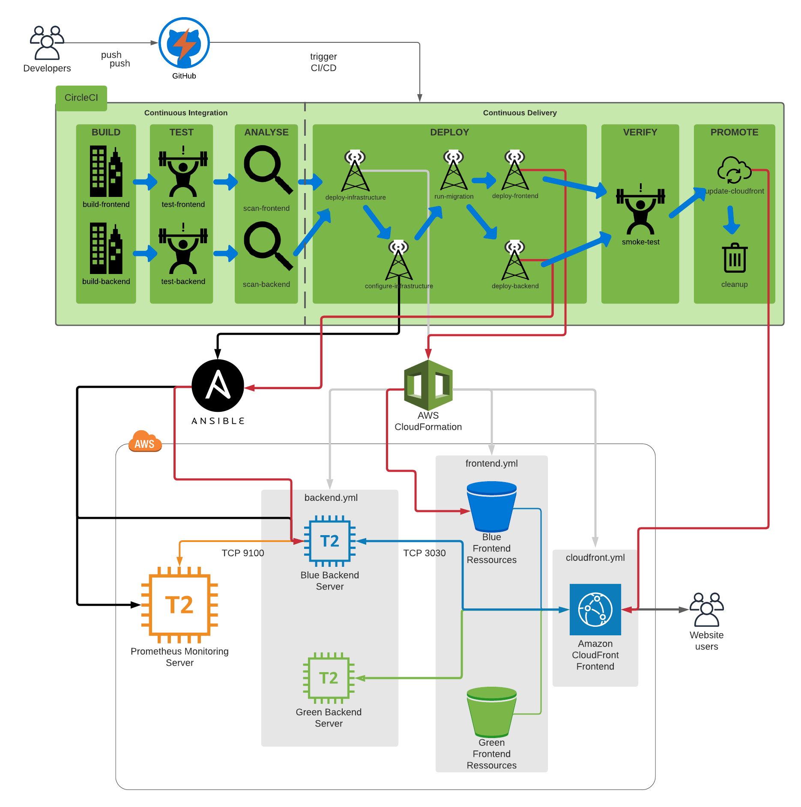

# CI/CD AWS deployment following the Blue|Green strategy

## Stack

- GitHub
- CircleCI
- AWS (EC2, Cloudformation, Cloudfront, S3)
- Ansible
- Prometheus (+ AlertManager)

  

## Project overview

  

## Why CI/CD?

<table>
<tr> 
    <td>  </td>
	<td>  </td> 
    <td>  </td> 
    <td>  </td> 
</tr> 
</table>

- Increase revenue
- Reduce cost
- Protect revenue
- Avoid cost

## Prerequise

- CircleCI account
- AWS account

## Deploy

Manually create an empty S3 bucket that is supposed to have the green version of application and deploy the cloudfront infrastructure associated thanks to the aws-manual-setup folder.

Start to follow the repository from CircleCI.
CircleCI will create a webhook in Github that will automatically trigger the CI/CD on each commit.
Continuous Deployment is launched and will update existing infrastructure as shown above.

Prometheus Monitoring Server is set up manually thanks to these very good articles:

- [Set up Prometheus Server on EC2](https://codewizardly.com/prometheus-on-aws-ec2-part1/)
- [Set up the prometheus node exporter service on the EC2 instance to monitor](https://codewizardly.com/prometheus-on-aws-ec2-part2/)
- [Configure Prometheus for AWS Service Discovery](https://codewizardly.com/prometheus-on-aws-ec2-part3/)
- [Install and configure AlertManager](https://codewizardly.com/prometheus-on-aws-ec2-part4/)

