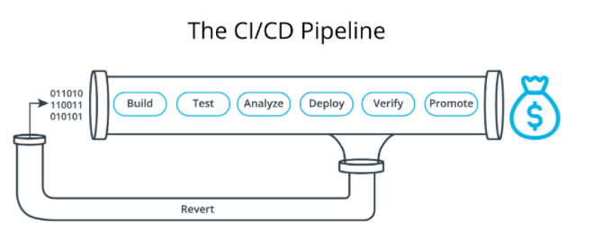

# CI/CD AWS deployment following the Blue|Green strategy

  

## Why CI/CD?

<table>
<tr> 
    <td>  </td>
	<td>  </td> 
    <td>  </td> 
    <td>  </td> 
</tr> 
</table>

- Increase revenue
- Reduce cost
- Protect revenue
- Avoid cost

## Prerequise

- CircleCI account
- AWS account

## Deploy
